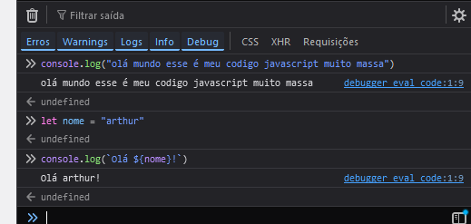
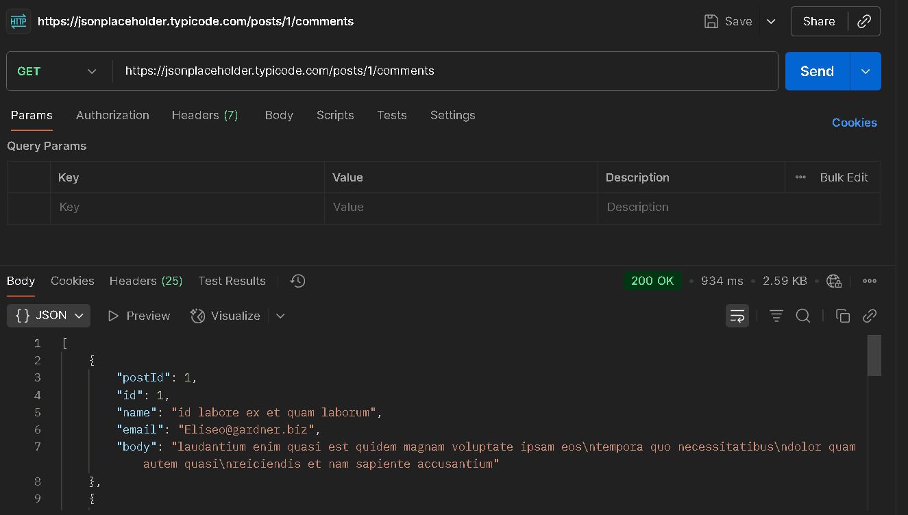

## Atividade Prática 1: Hello World Interativo
R:\


## 1. Desenvolvimento de APIs e o Protocolo HTTP

Pesquise e Defina: O que é uma API RESTful? Quais são as principais diferenças
entre ela e uma API SOAP?

R: Uma API RESTful é uma API (Application Programming Interfaces) que segue os padrões do REST (Representational State Transfer), um conjunto de padrões para o desenvolvimento de APIs que inclui: Uso do protocolo HTTP, distinção clara ente cliente e servidor e falta de estado.
Já uma API SOAP (Simple object access protocol) é um protoco mais antigo e complexo mantido pela W3C, não nescessáriamente usa HTTP e usa a formatação XML (APIs RESTful podem usar qualquer formato mas normalmente usan o JSON).

---

Pesquise e Explique: O que é o protocolo HTTP e quais são seus métodos mais
comuns (GET, POST, PUT, DELETE)? Como cada um deles se relaciona com as
operações de um CRUD?

R: HTTP (Hypertext Transfer Protocol) é um protocolo de aplicação, é o protocolo usado pela WEB, seus métodos comuns podem ser usados para criar um CRUD:
* GET - Método geralmente usado para ler informações, entra no R (read) do CRUD.
* POST - Método geralmente usado para enviar informação, pode entrar no C (create) do CRUD.
* PUT - Método usado para atualizar informações, pode entrar no U (update) do CRUD.
* DELETE - Método usado para deletar informações, entra no D (delete) do CRUD.

---

Pesquise e Explore: Encontre uma API pública e gratuita (por exemplo, a de um
site de filmes, previsão do tempo ou de uma rede social). Documente a URL base,
os endpoints disponíveis e como você usaria pelo menos um deles para fazer
uma requisição.

R: {JSON} Placeholder
é uma API pública usada para testes e protótipos tem como URL base https://jsonplaceholder.typicode.com/ e os seguintes endpoints:
* GET	/posts
* GET	/posts/1
* GET	/posts/1/comments
* GET	/comments?postId=1
* POST	/posts
* PUT	/posts/1
* PATCH	/posts/1
* DELETE	/posts/1

Por exemplo o "GET  /posts/1/comments" poderia ser usado para ler os comentários de um post.

---

Prática: Use a ferramenta Postman ou o Insomnia para fazer requisições a essa
API pública. Tire um print screen de uma requisição GET bem-sucedida,
mostrando os dados retornados.

R:\


## 2. Operações CRUD (Create, Read, Update, Delete)

Pesquise e Relacione: O termo CRUD não é exclusivo de APIs. Pesquise onde ele
é comumente aplicado no desenvolvimento de software. Por que ele é
considerado a espinha dorsal de muitas aplicações?

R: O CRUD é usado em toda aplicação onde a manipulação de dados persistentes é importante, uma caracteristícas da maioria das aplicações. É comunmente usado em banco de dados e arquiteturas como o REST.

---

Pesquise e Identifique: Para cada operação CRUD, qual método HTTP
correspondente você utilizaria em uma API RESTful e por quê?
* C (Create)
* R (Read)
* U (Update)
* D (Delete)

R:
* GET - Método geralmente usado para ler informações, entra no R (read) do CRUD.
* POST - Método geralmente usado para enviar informação, pode entrar no C (create) do CRUD.
* PUT - Método usado para atualziar informações, pode entrar no U (update) do CRUD.
* DELETE - Método usado para deletar informações, entra no D (delete) do CRUD.


---

Pesquise e Demonstre: Crie um diagrama ou um texto que descreva o fluxo de
dados em uma aplicação web simples que utiliza CRUD, desde o momento em que
o usuário clica em um botão até o dado ser salvo no banco de dados. Mencione as
tecnologias envolvidas (frontend, API, banco de dados).

R: Assim o que o botão é clicado (para postar um comentário por exemplo) a primeira coisa que acontece é o ``eventListener`` no javascript frontend do botão sendo ativado e detectando o clique, por exemplo:
```js
document.getElementById("botao-exemplo").addEventListener("click", evento => {
    // Processar clique...
});
```
Em seguida o código irá se comunicar com API backend da aplicação, isso poderia ser feito usando o fetch ``fetch``, por exemplo:
```js
fetch("/api/comentario", {
    method: "POST",
    headers: { /* Cabeçalho da requesição */ },
    body: { /* Dados do comentário */ },
    // ...
});
```
Agora a requisição será passada para ser processada pelo backend, um backend rodando em Node.js usando a biblioteca express, poderia processar a requesição da seguinte maneira:
```js
import express from "express";

const app = express();

// ...

app.post('/api/comentario', async (requesicao, resposta) => {
    const dados = requesicao.body;

    // Processamento dos dados...

    // Um status de 200 significa que a requesição foi processada com sucesso
    resposta.sendStatus(200);
});
```
Dentro da parte do código que processa os dados, a comunicação com o banco dados pode acontecer, caso uma tecnologia como o SQL seja utilizada para o banco de dados, geralmente uma ORM como o sequelize é utilizada, a ORM (Object-Relational Mapping) tem o objetivo de abstrair a comunicação com o banco dados:
```js
import { Sequelize, Model, DataTypes } from "sequelize";

const sequelize = new Sequelize("sqlite::memory:"); 

const Comentario = sequelize.define('Comentario', { 
    // Dados do comentário definidos por DataTypes
});
```
E dentro do POST:
```js
await Comentario.build({ /* Dados do comentário */ }).save();
```
Essa função do ORM irá ser traduzida para um comando SQL (SQLite foi o banco de dados utilizado no exemplo):
```sql
INSERT INTO Comentarios (coluna1, coluna2, ...) VALUES (dados1, dados2, ...)
```

## 3. Controle de Versão com Git

Pesquise e Explique: O que é o Git e por que ele é indispensável no
desenvolvimento de software, especialmente em equipes? O que é um
repositório?

R: Git é um programa de versionamento de software, é essensial para garantir que todas as iterações de um software esteja sempre acesível para o desenvolvedor, para equipes é ainda mais importante pois facilita e automatiza o compartilhamento de código e a integração de mudanças feitas por cada desenvolvedor indidualmente.

---

Pesquise e Diferencie: Qual a diferença entre Git e GitHub (ou GitLab, Bitbucket)?
Explique a função de cada um.

R: O git é apenas uma aplicação local na máquina do desenvolvedor e não pode efetuar o compartilhamento de código por si só, já o GitHub é uma plataforma usada para compartilhar e expor projetos do git na nuvem, outra plataformas alternativas como o GitLab e Bitbucket também existem.

---

Pesquise e Descreva: Liste e descreva brevemente o propósito dos seguintes
comandos Git:
* git init
* git add
* git commit
* git push
* git pull

R:
* git init: Cria um repositório git.
* git add: Adiciona arquivos para serem preparados para o próximo commit.
* git commit: Cria uma nova versão so software de acordo com as mudanças feitas, também inclui uma mensagem.
* git push: Transfere os dados do repositório local para o respositório remoto (Como o github).
* git pull: Transfere os dados do repostiório remoto para o repositório local.
